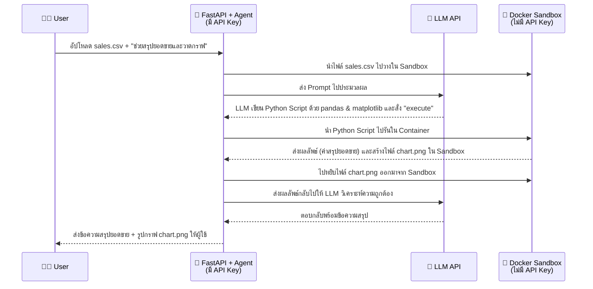
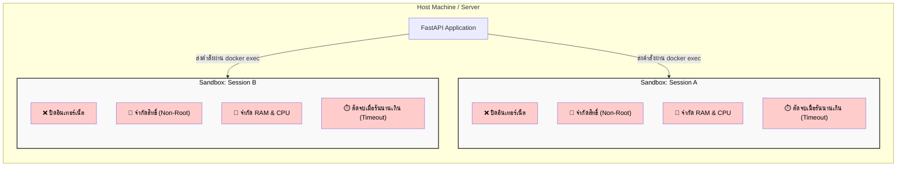

# การเชื่อมต่อ Sandbox เข้ากับ Docker สำหรับ Deep Agents (Presentation)

เอกสารนี้สรุปภาพรวมสำหรับใช้นำเสนอทีม เพื่อให้เห็นภาพการทำงาน (Flow) ว่า Deep Agents นำ Docker มาใช้เป็น Sandbox ได้อย่างไร รวมถึงระดับความยากในการนำไปใช้งานจริง โดยเน้นที่คอนเซปต์และโครงสร้าง ไม่เน้นโค้ด

---

## 1. ทำไมเราต้องมี Sandbox?

เมื่อเราให้ AI (Agent) สามารถรันคำสั่ง (Shell Command) หรือรันโค้ดได้จริง ความเสี่ยงที่จะเกิดขึ้นคือ:
- **ทำลายระบบ:** AI อาจจะเผลอรันคำสั่งลบไฟล์สำคัญ
- **ข้อมูลรั่วไหล:** AI อาจจะอ่าน Secret/API Key ในเครื่องแล้วส่งออกอินเทอร์เน็ต
- **กินทรัพยากร:** AI อาจเขียนโค้ดที่รันวนลูปไม่รู้จบ หรือใช้หน่วยความจำจนเครื่องค้าง
- **ข้อมูลปะปนกัน:** ผู้ใช้หลายคนเข้ามาใช้งานพร้อมกัน อาจจะมองเห็นไฟล์ของกันและกัน

**ทางแก้:** เราจึงต้องมี **Sandbox** (ห้องปฏิบัติการแยกส่วน) ที่ให้ AI เข้าไปทำอะไรก็ได้ตามอิสระ แต่ไม่สามารถส่งผลกระทบออกมายังเครื่องจริงได้ และเมื่อใช้งานเสร็จก็สามารถรื้อทิ้งได้ทันที

---

## 2. ภาพรวมการทำงาน (High-Level Flow)

Pattern ที่เราเลือกใช้คือ **"Sandbox as a tool"** หมายความว่า ตัว AI และ API Key จะอยู่ **นอก** Sandbox เสมอ ส่วน Sandbox มีหน้าที่แค่ "รับคำสั่งไปรัน" เท่านั้น

**ตัวอย่างการใช้งานจริง (Real Use Case): วิเคราะห์ข้อมูลยอดขาย**
> **โจทย์:** User อัปโหลดไฟล์ `sales.csv` แล้วพิมพ์สั่งว่า *"ช่วยสรุปยอดขายรวมแต่ละเดือน และวาดกราฟเส้นให้หน่อย"*



**ขยายความ: การใช้คำสั่ง "Execute" และการรันโค้ดใน Sandbox**
- **LLM สั่ง "Execute" คืออะไร?**
  ปกติแล้ว AI ทำได้แค่อ่านและพิมพ์ข้อความตอบกลับ แต่นักพัฒนาได้สร้าง "เครื่องมือ (Tool)" ที่ชื่อว่า `execute` เอาไว้ให้ AI เรียกใช้ เมื่อ AI วิเคราะห์แล้วว่าโจทย์นี้ต้องใช้การคำนวณหรือต้องใช้ไลบรารีอย่าง `pandas` มันจะทำการเขียนโค้ด Python ขึ้นมา และส่งคำขอเรียก Tool `execute` พร้อมแนบโค้ดนั้นมาด้วย
- **การนำ Python Script ไปรันใน Sandbox เกิดขึ้นได้อย่างไร?**
  เมื่อระบบ (FastAPI) ได้รับคำขอ `execute` จาก AI ระบบจะไม่รันโค้ดนั้นบนเซิร์ฟเวอร์โดยตรงเด็ดขาด แต่ระบบจะส่งโค้ดนั้นทะลุกำแพงเข้าไปใน **Docker Sandbox** ผ่านคำสั่งเบื้องหลังอย่าง `docker exec` เพื่อให้รันในสภาพแวดล้อมที่ปิดตาย เมื่อโค้ดรันเสร็จสิ้น ไม่ว่าจะสำเร็จ เกิด Error หรือวาดรูปกราฟเสร็จ ผลลัพธ์ทั้งหมดจะถูกโยนกลับมาให้ระบบพิจารณาต่อ โดยที่เซิร์ฟเวอร์หลักของเรายังปลอดภัย 100%

---

## 3. สถาปัตยกรรมและการป้องกัน (Architecture & Security)

เพื่อให้มั่นใจว่า AI จะไม่ทะลุออกมาทำลายระบบหรือล้วงข้อมูล เราได้ตั้งค่าการป้องกัน (Security Boundaries) ใน Docker ไว้ดังนี้:



**การป้องกันหลักที่เราวางไว้:**
- **ตัดขาดอินเทอร์เน็ต (`network_mode="none"`):** ป้องกันการดาวน์โหลดสคริปต์อันตราย หรือส่งข้อมูลออกนอกระบบ
- **ลดระดับผู้ใช้ (User `1000:1000`):** ไม่มีสิทธิ์ระดับ Root ป้องกันการแก้ไขไฟล์ระบบ
- **คุมทรัพยากร:** ตั้งลิมิต RAM/CPU ป้องกันระบบล่ม
- **ไม่ใส่ Secrets ใดๆ:** สภาพแวดล้อมภายในขาวสะอาด ไม่มี `.env` หลุดเข้าไป
- **แยกห้อง 100%:** 1 แชท 1 กล่อง ไม่มีการแชร์ไฟล์ระหว่าง Session

---

## 4. วงจรชีวิตของ Sandbox (Lifecycle)

เพื่อให้ระบบใช้ทรัพยากรอย่างคุ้มค่า เราไม่ได้เปิด Sandbox ทิ้งไว้ตลอดเวลา:

1. **สร้างเมื่อเรียกใช้ (Lazy Create):** จะสร้าง Container ให้เฉพาะเมื่อมีการร้องขอใช้งาน Tool เท่านั้น
2. **ใช้ซ้ำตลอด Session:** ใน 1 แชท จะใช้ Container เดิมเสมอ เพื่อให้ไฟล์เก่าๆ ยังอยู่
3. **ทำลายทิ้งเมื่อไม่ใช้งาน (Idle Timeout):** หากทิ้งไว้ไม่มีคนคุยด้วยเกินระยะเวลาที่กำหนด (เช่น 15 นาที) ระบบจะลบ Container ทิ้งอัตโนมัติเพื่อคืนทรัพยากร
4. **ทำความสะอาด (Cleanup):** ตอนสั่งปิด Server จะไล่ปิดและลบ Sandbox ที่ตกค้างทิ้งทั้งหมด

---

## 5. ประเมินระดับความยากและเวลาที่ใช้ (Difficulty & Effort)

- **ระดับความยากโดยรวม:** 🟢 **ง่าย – ปานกลาง (Easy to Medium)**
- **เวลาที่คาดว่าจะใช้พัฒนา:** ⏱️ **~0.5 – 1.5 วัน** (สำหรับการทำระบบพื้นฐาน)

**รายละเอียด:**
- **การเขียนโค้ดเพื่อเชื่อม Docker:** **ง่าย-ปานกลาง** (เขียนเพิ่มประมาณ 170 บรรทัด โดยเขียนเมธอดหลักแค่ 4 ตัว: `execute`, `upload`, `download`, ดึง `id`)
- **การจัดการ Session & ความปลอดภัย:** **ง่าย** (ใช้ Config ของ Docker ธรรมดา)
- **การเชื่อมเข้ากับ FastAPI & Agent:** **ง่าย** (ใช้ Tools ที่ LangChain มีให้)

**สรุป:** 
การต่อ Sandbox เข้ากับ Docker ไม่ได้ซับซ้อนอย่างที่คิด เพราะ LangChain (Deep Agents) วางโครงสร้างมาตรฐานไว้ให้แล้ว เราเพียงแค่เขียนตัวกลาง (Bridge) ไปสั่งการ Docker CLI และปรับแต่งความปลอดภัย (Security) ให้รัดกุมตาม Guideline เท่านั้น ถือว่าเป็นฟีเจอร์ที่คุ้มค่าต่อการลงทุนเพื่อแลกกับความปลอดภัยและความสามารถที่เพิ่มขึ้นของ AI

---

## 6. การนำไปใช้กับแอปพลิเคชันภายในองค์กร (Enterprise Application)

การนำ POC ตัวนี้ไปใช้ในองค์กรถือว่าเหมาะสมและมาถูกทางมาก แต่มีข้อควรปรับปรุงเพิ่มเติมเพื่อให้พร้อมใช้งานจริงระดับ Production:

- **🔐 ข้อมูลความลับ (Data Privacy):** เปลี่ยนไปใช้ **Local LLM** (เช่น Llama 3) ที่รันบนเซิร์ฟเวอร์ของบริษัท เพื่อรับประกันว่าข้อมูลยอดขายหรือข้อมูลส่วนบุคคลจะไม่มีวันหลุดออกนอกองค์กร
- **🗄️ การเข้าถึงข้อมูลภายใน (Internal Data Access):** หากต้องการให้ AI ดึงข้อมูลจากฐานข้อมูลบริษัท ให้เปิดช่องเครือข่าย (Network Rule) เฉพาะทางให้ Sandbox วิ่งเข้าหา Database แบบ Read-Only ได้ โดยยังคงปิดการเชื่อมต่ออินเทอร์เน็ตภายนอกไว้
- **🚀 การรองรับผู้ใช้จำนวนมาก (Scalability):** หากมีพนักงานใช้งานหลักพันคน อาจจะต้องเปลี่ยนจาก Docker ธรรมดาไปใช้ระบบจัดการที่ใหญ่ขึ้นอย่าง **Kubernetes (K8s)** เพื่อกระจาย Sandbox ไปยังเซิร์ฟเวอร์หลายๆ เครื่อง
- **👤 การยืนยันตัวตน (Authentication):** นำไปผูกกับระบบล็อกอินของบริษัท (เช่น Microsoft Entra ID) และผูก ID Sandbox เข้ากับพนักงาน เพื่อรับประกันว่าสิทธิ์ของแต่ละแผนกจะถูกแยกออกจากกันอย่างเด็ดขาด

---

## 7. ตัวอย่างโค้ดและการตั้งค่าจริงในโปรเจกต์ (Configuration & Code)

เพื่อให้ทีมเห็นภาพชัดเจนว่าต้องไปแก้ตรงไหน นี่คือตัวอย่างจากไฟล์จริงในโปรเจกต์ (POC) ของเราครับ:

### 1. ตั้งค่าผ่านไฟล์ `.env`
เราดึงค่า Limit ต่างๆ ออกมาไว้ข้างนอกทั้งหมด เพื่อให้ทีม Infra หรือ DevOps สามารถปรับจูนได้ง่ายโดยไม่ต้องแก้โค้ด

```env
# ตั้งค่าความปลอดภัยของ Docker Sandbox
SANDBOX_NETWORK=none          # ปิดเน็ต (ถ้าอยากให้ต่อ DB ภายในได้ให้เปลี่ยนตรงนี้)
SANDBOX_MEM=512m              # จำกัด RAM ต่อ 1 Sandbox (รองรับ User ได้เยอะขึ้น)
SANDBOX_CPUS=1.0              # จำกัด CPU ไม่ให้ดึงพลังเครื่องไปหมด
SANDBOX_PIDS_LIMIT=256        # กันโปรแกรมแฮงค์แล้ว fork process จนเครื่องค้าง
SANDBOX_EXEC_TIMEOUT=60       # ให้เวลารันโค้ดสูงสุดแค่ 60 วินาที
SANDBOX_IDLE_TTL=900          # ถ้าไม่มีใครคุยด้วย 15 นาที (900 วิ) ลบทิ้งทันที
```

### 2. โค้ดคำสั่งสร้าง Sandbox ในไฟล์ `app/sessions.py`
ระบบจะดึงค่าจาก `.env` ด้านบนมาใช้สร้าง Container นี่คือโค้ด Python จริงที่เราใช้บังคับความปลอดภัย (Security Boundaries):

```python
    def _run_container(self, thread_id: str):
        """สร้าง container พร้อมค่าความปลอดภัยทั้งหมด"""
        return self.client.containers.run(
            settings.sandbox_image,                  # Image ที่เตรียมไว้ (มี Python, pandas แต่ไม่มี Secret)
            name=f"sandbox-{thread_id}",             # 1 Session = 1 กล่อง (ชื่อห้ามซ้ำ)
            detach=True,                             # รันเป็น Background
            init=settings.sandbox_init,              # จัดการ Process ป้องกัน Zombie Process
            labels={"app": settings.sandbox_label, "thread_id": thread_id},
            user=settings.sandbox_user,              # 👤 บังคับรันเป็น user "1000:1000" (ไม่ใช่ root)
            working_dir=settings.sandbox_workdir,
            
            # --- 🛡️ หัวใจสำคัญเรื่องความปลอดภัย ---
            network_mode=settings.sandbox_network,   # ❌ ปิดเน็ต 100% ตามค่าใน .env
            mem_limit=settings.sandbox_mem,          # 💾 จำกัด RAM
            memswap_limit=settings.sandbox_mem,      # 💾 ห้ามแอบใช้ Swap เพิ่ม (กันดิสก์เต็ม)
            nano_cpus=int(settings.sandbox_cpus * 1e9), 
            pids_limit=settings.sandbox_pids_limit,  # 💣 กัน Fork Bomb
            cap_drop=["ALL"],                        # 🔒 ริบสิทธิ์พิเศษระดับ OS (Linux capabilities) ทิ้งทั้งหมด
            security_opt=["no-new-privileges:true"], # 🔒 ห้ามแอบยกระดับสิทธิ์ตัวเอง (setuid) ภายหลัง
            environment={},                          # 🚫 ส่ง dict ว่างเข้าไป = ไม่ส่ง API Key หรือ Secret เลย
        )
```
