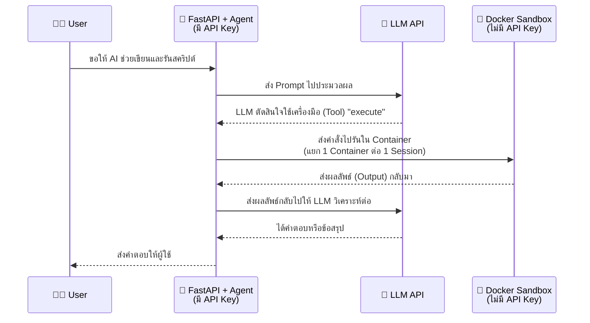

# การเชื่อมต่อ Sandbox เข้ากับ Docker สำหรับ Deep Agents (Presentation)

เอกสารนี้สรุปภาพรวมสำหรับใช้นำเสนอทีม เพื่อให้เห็นภาพการทำงาน (Flow) ว่า Deep Agents นำ Docker มาใช้เป็น Sandbox ได้อย่างไร รวมถึงระดับความยากในการนำไปใช้งานจริง โดยเน้นที่คอนเซปต์และโครงสร้าง ไม่เน้นโค้ด

---

## 1. ทำไมเราต้องมี Sandbox?

เมื่อเราให้ AI (Agent) สามารถรันคำสั่ง (Shell Command) หรือรันโค้ดได้จริง ความเสี่ยงที่จะเกิดขึ้นคือ:
- **ทำลายระบบ:** AI อาจจะเผลอรันคำสั่งลบไฟล์สำคัญ
- **ข้อมูลรั่วไหล:** AI อาจจะอ่าน Secret/API Key ในเครื่องแล้วส่งออกอินเทอร์เน็ต
- **กินทรัพยากร:** AI อาจเขียนโค้ดที่รันวนลูปไม่รู้จบ หรือใช้หน่วยความจำจนเครื่องค้าง
- **ข้อมูลปะปนกัน:** ผู้ใช้หลายคนเข้ามาใช้งานพร้อมกัน อาจจะมองเห็นไฟล์ของกันและกัน

**ทางแก้:** เราจึงต้องมี **Sandbox** (ห้องปฏิบัติการแยกส่วน) ที่ให้ AI เข้าไปทำอะไรก็ได้ตามอิสระ แต่ไม่สามารถส่งผลกระทบออกมายังเครื่องจริงได้ และเมื่อใช้งานเสร็จก็สามารถรื้อทิ้งได้ทันที

---

## 2. ภาพรวมการทำงาน (High-Level Flow)

Pattern ที่เราเลือกใช้คือ **"Sandbox as a tool"** หมายความว่า ตัว AI และ API Key จะอยู่ **นอก** Sandbox เสมอ ส่วน Sandbox มีหน้าที่แค่ "รับคำสั่งไปรัน" เท่านั้น



---

## 3. สถาปัตยกรรมและการป้องกัน (Architecture & Security)

เพื่อให้มั่นใจว่า AI จะไม่ทะลุออกมาทำลายระบบหรือล้วงข้อมูล เราได้ตั้งค่าการป้องกัน (Security Boundaries) ใน Docker ไว้ดังนี้:

```mermaid
flowchart LR
    subgraph Host[Host Machine / Server]
        API[FastAPI Application]
        
        subgraph Sandbox1[Sandbox: Session A]
            direction TB
            S1[❌ ปิดอินเทอร์เน็ต]
            S2[👤 จำกัดสิทธิ์ (Non-Root)]
            S3[💾 จำกัด RAM & CPU]
            S4[⏱️ ตัดจบเมื่อรันนานเกิน (Timeout)]
        end
        
        subgraph Sandbox2[Sandbox: Session B]
            direction TB
            S5[❌ ปิดอินเทอร์เน็ต]
            S6[👤 จำกัดสิทธิ์ (Non-Root)]
            S7[💾 จำกัด RAM & CPU]
            S8[⏱️ ตัดจบเมื่อรันนานเกิน (Timeout)]
        end
        
        API -->|ส่งคำสั่งผ่าน docker exec| Sandbox1
        API -->|ส่งคำสั่งผ่าน docker exec| Sandbox2
    end
    
    style Sandbox1 fill:#f9f9f9,stroke:#333,stroke-width:2px,color:#000
    style Sandbox2 fill:#f9f9f9,stroke:#333,stroke-width:2px,color:#000
    style S1 fill:#ffcccc,color:#000
    style S2 fill:#ffcccc,color:#000
    style S3 fill:#ffcccc,color:#000
    style S4 fill:#ffcccc,color:#000
    style S5 fill:#ffcccc,color:#000
    style S6 fill:#ffcccc,color:#000
    style S7 fill:#ffcccc,color:#000
    style S8 fill:#ffcccc,color:#000
```

**การป้องกันหลักที่เราวางไว้:**
- **ตัดขาดอินเทอร์เน็ต (`network_mode="none"`):** ป้องกันการดาวน์โหลดสคริปต์อันตราย หรือส่งข้อมูลออกนอกระบบ
- **ลดระดับผู้ใช้ (User `1000:1000`):** ไม่มีสิทธิ์ระดับ Root ป้องกันการแก้ไขไฟล์ระบบ
- **คุมทรัพยากร:** ตั้งลิมิต RAM/CPU ป้องกันระบบล่ม
- **ไม่ใส่ Secrets ใดๆ:** สภาพแวดล้อมภายในขาวสะอาด ไม่มี `.env` หลุดเข้าไป
- **แยกห้อง 100%:** 1 แชท 1 กล่อง ไม่มีการแชร์ไฟล์ระหว่าง Session

---

## 4. วงจรชีวิตของ Sandbox (Lifecycle)

เพื่อให้ระบบใช้ทรัพยากรอย่างคุ้มค่า เราไม่ได้เปิด Sandbox ทิ้งไว้ตลอดเวลา:

1. **สร้างเมื่อเรียกใช้ (Lazy Create):** จะสร้าง Container ให้เฉพาะเมื่อมีการร้องขอใช้งาน Tool เท่านั้น
2. **ใช้ซ้ำตลอด Session:** ใน 1 แชท จะใช้ Container เดิมเสมอ เพื่อให้ไฟล์เก่าๆ ยังอยู่
3. **ทำลายทิ้งเมื่อไม่ใช้งาน (Idle Timeout):** หากทิ้งไว้ไม่มีคนคุยด้วยเกินระยะเวลาที่กำหนด (เช่น 15 นาที) ระบบจะลบ Container ทิ้งอัตโนมัติเพื่อคืนทรัพยากร
4. **ทำความสะอาด (Cleanup):** ตอนสั่งปิด Server จะไล่ปิดและลบ Sandbox ที่ตกค้างทิ้งทั้งหมด

---

## 5. ประเมินระดับความยากและเวลาที่ใช้ (Difficulty & Effort)

- **ระดับความยากโดยรวม:** 🟢 **ง่าย – ปานกลาง (Easy to Medium)**
- **เวลาที่คาดว่าจะใช้พัฒนา:** ⏱️ **~0.5 – 1.5 วัน** (สำหรับการทำระบบพื้นฐาน)

**รายละเอียด:**
- **การเขียนโค้ดเพื่อเชื่อม Docker:** **ง่าย-ปานกลาง** (เขียนเพิ่มประมาณ 170 บรรทัด โดยเขียนเมธอดหลักแค่ 4 ตัว: `execute`, `upload`, `download`, ดึง `id`)
- **การจัดการ Session & ความปลอดภัย:** **ง่าย** (ใช้ Config ของ Docker ธรรมดา)
- **การเชื่อมเข้ากับ FastAPI & Agent:** **ง่าย** (ใช้ Tools ที่ LangChain มีให้)

**สรุป:** 
การต่อ Sandbox เข้ากับ Docker ไม่ได้ซับซ้อนอย่างที่คิด เพราะ LangChain (Deep Agents) วางโครงสร้างมาตรฐานไว้ให้แล้ว เราเพียงแค่เขียนตัวกลาง (Bridge) ไปสั่งการ Docker CLI และปรับแต่งความปลอดภัย (Security) ให้รัดกุมตาม Guideline เท่านั้น ถือว่าเป็นฟีเจอร์ที่คุ้มค่าต่อการลงทุนเพื่อแลกกับความปลอดภัยและความสามารถที่เพิ่มขึ้นของ AI
